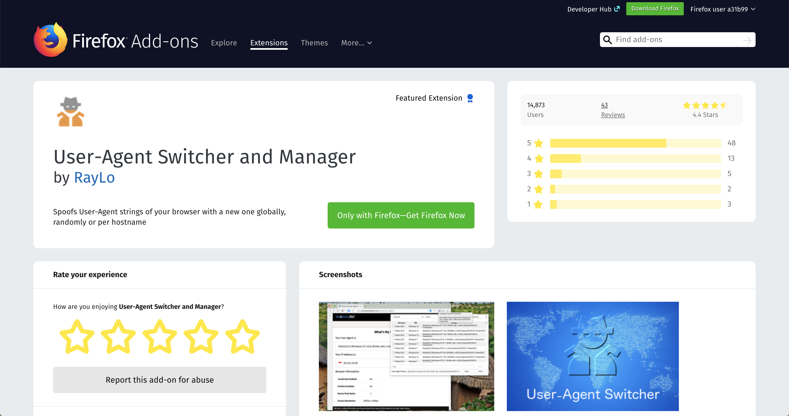
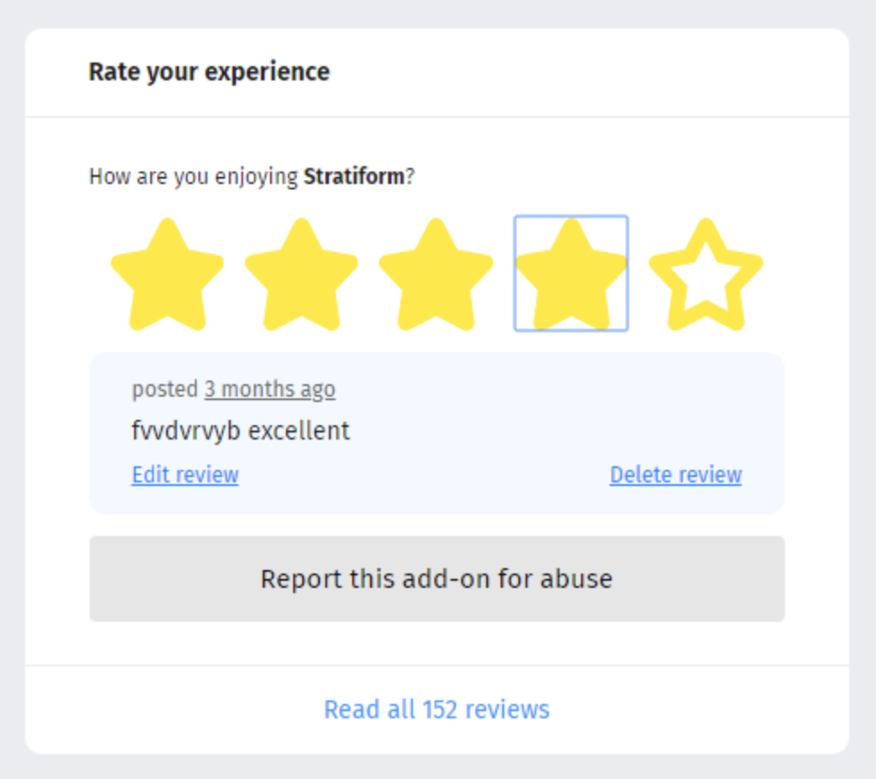

<re-img src="cover.png"></re-img>

My fifth contribution for Hacktoberfest was done in <a href="https://github.com/mozilla/addons-frontend" target="_blank" rel="noopener noreferrer">Mozilla add-ons front-end</a> project.

> <a href="https://addons.mozilla.org/en-US/firefox/" target="_blank" rel="noopener noreferrer">Addons.mozilla.org</a> (AMO), is Mozilla’s official site for discovering and installing add-ons for the Firefox browser. Add-ons help you modify and personalize your browsing experience by adding new features to Firefox, enhancing your interactions with Web content, and changing the way your browser looks. (Retrieved AMO website)

Add-ons, also called extensions, have their own page with a description, rating, downloads stats, screenshots:


I came across an <a href="https://github.com/mozilla/addons-frontend/issues/6755" target="_blank" rel="noopener noreferrer">issue that required to remove outline from Rating stars</a> when selected on Chrome.

Here is a screenshot of how it used to work before I came to the project:


It is a default behaviour for Chrome. As I worked with front-end a lot, I fixed this problem so many times by adding the following line to CSS:
```css
outline: none;
```

So I added this line to the RatingStar component’s styles inside the project, created a Pull Request, but the collaborator kindly let me know that the solution is supposed to be a little bit different:
```css
&:not(.focus-visible) {
    outline: none;
}
```

This should be fixed in this way because the `outline` should be applied when the focus is given by the mouse, but not when it is given by the keyboard;

So I edited my code again, and my Pull Request was merged 🎉

It was such a great experience contributing to this project because community is very nice there. I felt welcomed there, and I think it’s very important for “outside” contributors. Also, I was listed on <a href="https://wiki.mozilla.org/Add-ons/Contribute/Recognition" target="_blank" rel="noopener noreferrer">Mozilla’s Recognition page</a>, and I was vouched a <a href="https://mozillians.org/en-CA/" target="_blank" rel="noopener noreferrer">Mozillian</a> account 🦊👍