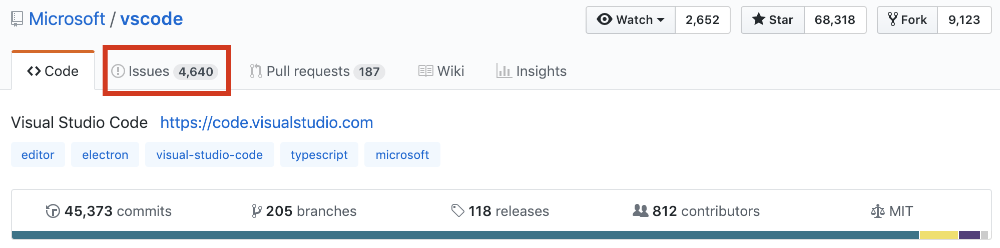
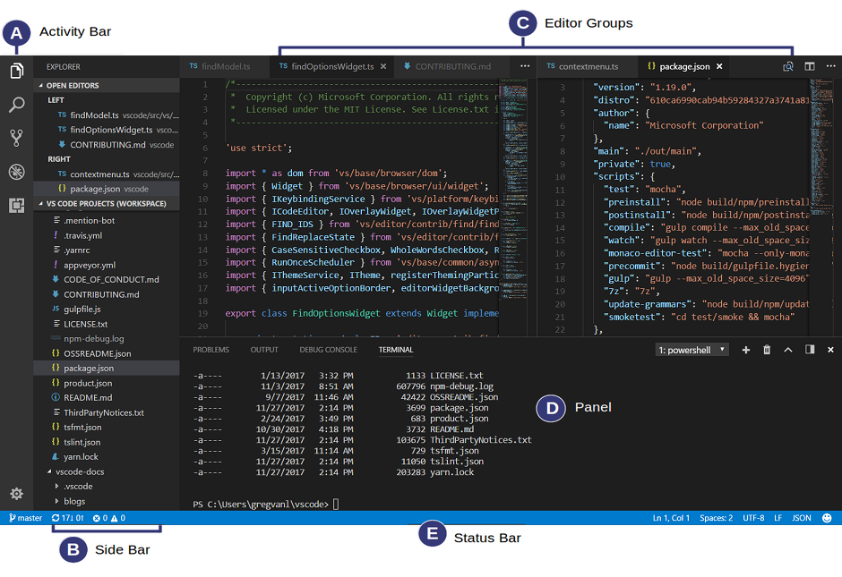

<re-img src="cover.png"></re-img>

I’ve been looking for an issue to work on in big open source projects earlier this week, and I came across <a href="https://github.com/Microsoft/vscode" target="_blank" rel="noopener noreferrer">VSCode repo</a> on GitHub. I’ve never contributed to any Microsoft’s projects before, and I didn’t really think about doing that even though I use VSCode a lot. Every time I looked at the list of issues in VSCode repo, I thought it’s very hard to find a good one to work because it seemed to me that most of them are created by its users and not verified by project’s maintainers.

Writing a code that is not going to be accepted (or even reviewed) eventually is probably one of the saddest things in open source.

However, some of my peers in open source class have contributed to this project, and they shared their strategy in finding issues. Basically, they looked for older issues that nobody worked on or fixed yet. I tried this strategy and I came across an <a href="https://github.com/Microsoft/vscode/issues/64669" target="_blank" rel="noopener noreferrer">issue</a> filed two months ago. I found that there was a member of Microsoft organization assigned to this issue, but there was no Pull Request submitted yet. I asked if I can work on this issue, and he got back to me and said that I can work on it.

## Issue

First, for those of you who haven’t worked with VSCode before, let’s take a look at its interface:

If you take a look at Activity Bar (A), there are 5 sections:
_1._ File explorer
_2._ Search
_3._ Source Control
_4._ Debugger
_5._ Extensions

The filed issue is about Extensions part of the Activity Bar, and the requested the following feature:
> It would be helpful if the search bar in the Extensions Side Bar maintained its value when reloading the window. (<a href="https://github.com/Microsoft/vscode/issues/64669#issue-388952784" target="_blank" rel="noopener noreferrer">issue description</a>)

## Current behavior

Steps to reproduce this bug:
_1._ Type something in extensions search
_2._ Reload window

After reloading window, the search bar has no value.

In order to fix this bug, I have to find a way to save the value when the window is reloaded.

## Research
My very first step was to look for similar resolved issues in the repository. After a comprehensive search, I didn’t find any closed Pull Request similar to this issue. That’s why I had to start exploring the codebase of the project.
As I mentioned above, I haven’t worked with VSCode codebase before, so the first thing I had to do is to find where is the source code for extensions. Fortunately, big projects like VSCode usually have good documentation, and I found a <a href="https://github.com/Microsoft/vscode/wiki/Code-Organization" target="_blank" rel="noopener noreferrer">code organization page</a>.

I read it and found that all Activity Bar code is under `src/vs/workbench` folder. I started looking through it. I found `parts` folder there, which contains all parts of the workbench including `extensions`.

I began studying the codebase of the extensions. It was a lot of new code for me. I wrote some small changes, debugged some code in order to get a better understanding of how their code works.

I still couldn’t figure out how I can keep the value after window reloading. Then, I tried to find out if there is any other part of the Activity Bar that stores the value of the input after reloading the window, and I found one! The search part of Activity Bar. Its input has the value even if you reload the window.

I understood that the similar feature is already implemented somewhere in the code.

I did some debugging for search input and extensions input during the reloading window. The call stack is similar but different at the same time.

After my research, I guess that the reason why search input saves the value is that it implements `viewletState` which keeps track of the component state. I didn’t find any similar things in the implementation of the `extensions` input, so I’ve shared my guess in the issue discussion, and I wait for a response from the contributor.
