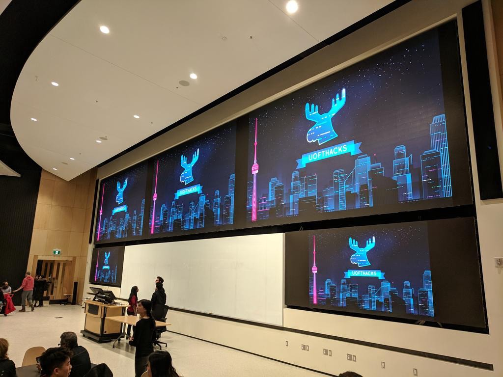
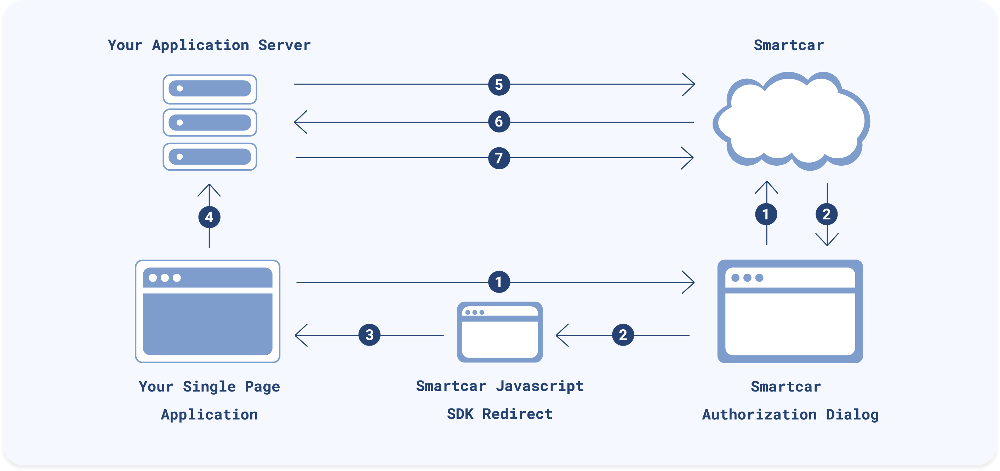
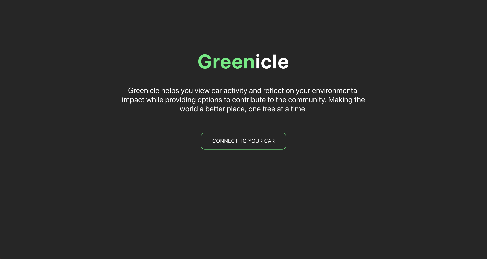
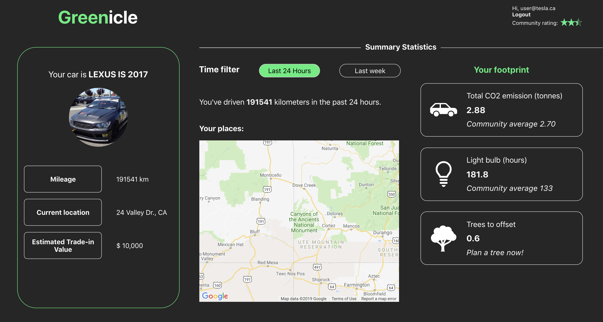
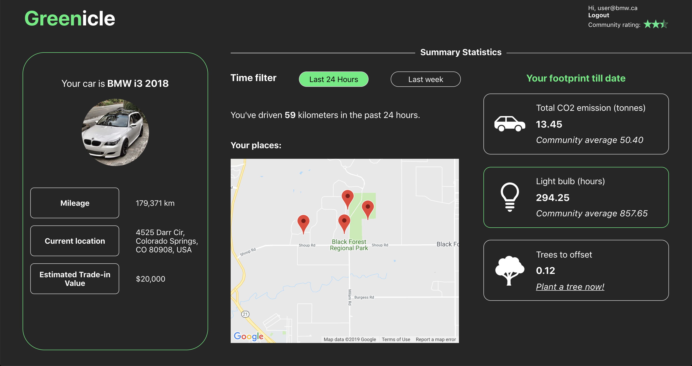
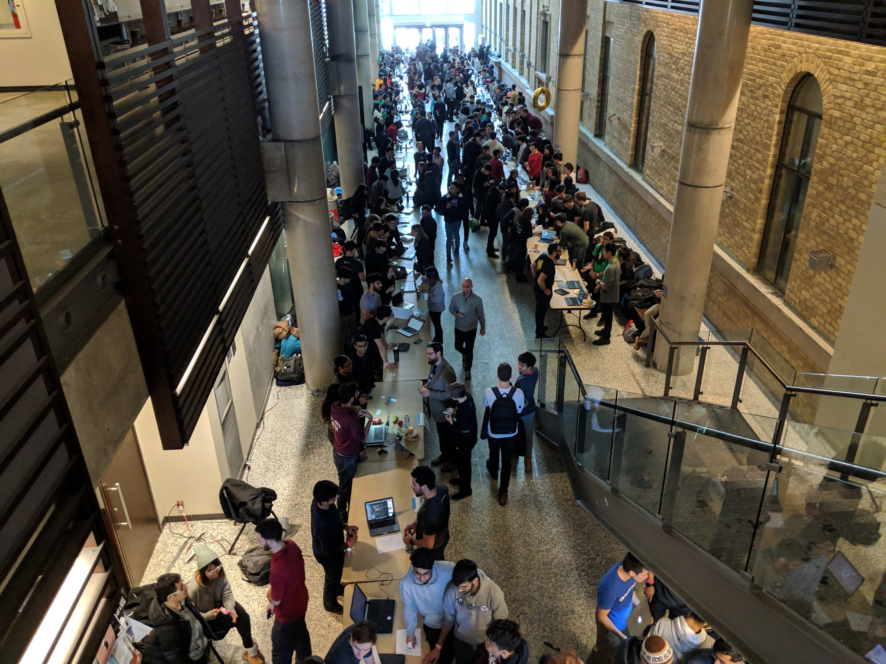

<re-img src="cover.png"></re-img>

Two weeks ago, I attended <a href="https://uofthacks.com/" target="_blank" rel="noopener noreferrer">UofTHacks</a> — a 36-hour <a href="https://mlh.io/" target="_blank" rel="noopener noreferrer">MLH</a> hackathon hosted by the University of Toronto. 500 students (about 100 teams) from Canada and the United States of America spent their weekend generating ideas and developing prototypes of their ideas. Teams could hack on whatever they wanted. There were prizes for top 3 hacks as well as prizes for sponsors’ challenges. I teamed up with my friends, whom I have met during my internship at Royal Bank of Canada. Our team consisted of one business person — Samana, and three devs — Miranda, Patricia, and myself.

The opening ceremony took place on Friday evening, where organizers and sponsors welcomed all the hackers, and the UofTHacks VI officially started!

Then we had chicken curry for dinner 😋🍛

After that, my team and I started a discussion of what we want to build in the following 36 hours.

## Idea
First of all, we looked at the list of challenges and brainstormed ideas for each challenge. At some point, <a href="https://smartcar.com/" target="_blank" rel="noopener noreferrer">Smartcar API</a> caught my attention, and I thought: “What can we build with it?“

The most obvious option is car sharing app because Smartcar API can provide the <a href="https://smartcar.com/docs/api#get-location" target="_blank" rel="noopener noreferrer">location</a> of the vehicle. My first suggestion was Airbnb for cars. The idea was that user would be able to rent vehicles from other people. However, a quick Google search showed that there is an existing startup called <a href="https://turo.com/" target="_blank" rel="noopener noreferrer">Turo</a> in Silicon Valley.

My follow-up idea was Tinder for cars 😆 Actually, there were a few “Tinder for cars” on Google, but those apps were supposed to connect car buyers with car sellers/dealerships. My idea was to connect car drivers, who want to escape from their day-to-day driving experience and replace it with a new car for some time.

Our team discussed this idea, and we decided to proceed with it. The next step was to think about some features of the app. We came up with two main parts of the potential app:

- Car dashboard — displays car information
- Matching screen — car enthusiasts would look for a car they want to drive for next couple of days

## Design
Then we thought about what kind of data we can display. Here is the data we can get for each vehicle from Smartcar API:
- Basic vehicle info (id, make, model, year)
- User ID
- Location of the car
- Odometer value
- VIN (vehicle’s manufacturer identifier)

_You can also lock and unlock a car with this API!_

We chose the make, model, year, current location and odometer value to be displayed on our dashboard. However, we felt like it was not enough, so we tried to add more metrics, and here what we got eventually:
- Estimated retail value of the car 🏷
- Total CO2 emissions 💨
- Their equivalent in light bulb hours 💡
- The number of trees that would need to be planted in order to offset the effect of the emissions 🌳

All of the metrics above, we calculate using the vehicle’s information from Smartcar API. Another idea was to display the location history of the car; we would implement this by tracking the car’s location periodically. It seemed like the dashboard can be its own application without “Tinder” functionality, so we put aside that idea and began developing the architecture of the project. In summary, our project was supposed to use **Python Flask** for the back-end, **React** for front-end, **Microsoft Azure Cosmos DB**, some other Microsoft services such as **Microsoft Bing** image search, and all of that would be deployed to **Azure cloud**. As you can notice, there are many Microsoft Azure products in our architecture. Actually, none of us had much experience with Azure, but we decided to try using it because we wanted to participate in Microsoft’s challenge for the best use of Azure services.

After architecture was done, we started prototyping the UI of a web app.

Samana and I worked on it, and we designed the following workflow: 
_1._ **Login page**. Here, the user would be prompted to authenticate themselves on the Smartcar Authorization Dialog 
_2._ In case of successful authorization, the vehicle’s data and environmental impact would be displayed on **the dashboard**. 

Oh, we also gave our project a name! We called it **Green**icle. ️

We finished our UI prototypes on Saturday at about 6.30 a.m., so **we had about 27 hours to develop the app**.

## Development
Each member of the team started doing their tasks. Samana worked on a digital version of our UI prototypes, Miranda did her research on the best practices of integrating our project with Azure products, Patricia started back-end dev, and I started working on front-end.

First, I learned Smartcar docs in order to find out how to start. As we were building our app with React, I read <a href="https://smartcar.com/docs/integration-guides/react/introduction/" target="_blank" rel="noopener noreferrer">React integration guide in the documentation</a>.

The instructions are pretty straight forward, and they also provide a <a href="https://github.com/smartcar/getting-started-javascript-sdk-react" target="_blank" rel="noopener noreferrer">starter kit</a>.

In less than an hour, I had my basic app set up, and this app could authenticate users with Smartcar Authorization Dialog. Let’s take a look at the architecture of our newly created Single Page App:

Thanks to the starter kit, I saved my time from implementing the following architecture in my app, and I could focus on building UI instead.

I started implementing UI of our Login page. It didn’t take long to develop Login page as it basically consists of a logo, description and a button. Here is how our login page looked like eventually:

Then I moved forward to the next step, which was the **Dashboard**. While our back-end was still in development, I was building a static version of the dashboard. _Because of limited time, I didn’t really try to write beautiful code; instead, I focused on writing code that works_. In order to save time, I also didn’t break UI into a component hierarchy. Most of the code I wrote was inside my page components: `Home.jsx` and `Dashboard.jsx`.

The dashboard was supposed to have two main sections: 
_1._ Vehicle information section, which includes its make, model, year, total mileage, current location and estimated retail value. 
_2._ Statistics section, which displays location timeline and mileage based on selected time filter (past 24 hours/past week), and environmental impact metrics.

This is how the dashboard with static values looked like:

Once I had developed the dashboard with static values, the majority of the endpoints in the back-end were implemented. Therefore, I could start replacing the hardcoded labels with data retrieved from Smartcar API.

The following screenshot is the final version of the dashboard, which displays data dynamically.

Some of the values are random there such as location history and mileage for the past 24 hours/week because we basically didn’t have enough time to collect that data. Everything else is calculated or received from Smartcar API. Let’s take a closer look at each section.

## Vehicle information
Title contains make, model and the year of the user’s vehicle. We access this data from <a href="https://github.com/smartcar/getting-started-javascript-sdk-react" target="_blank" rel="noopener noreferrer">Basic Vehicle Info endpoint</a>.

We also implemented some kind of image generator based on the make and model of the car, and we used <a href="https://github.com/smartcar/getting-started-javascript-sdk-react" target="_blank" rel="noopener noreferrer">Microsoft Azure Bing Image Search</a> because our initial plan was to use as many Azure services as possible in order to participate in Microsoft’s challenge. Frankly speaking, this service didn’t meet our expectations as found images weren’t correct in most cases. We’d better use Google’s service for image search.

Mileage metric is retrieved from <a href="https://smartcar.com/docs/api#get-odometer" target="_blank" rel="noopener noreferrer">Odometer endpoint</a> of Smartcar API. The same applies to the current location of the vehicle. However, we had to make another extra step to display it in a proper format. When you request car’s location from the <a href="https://smartcar.com/docs/api#get-location" target="_blank" rel="noopener noreferrer">Location endpoint</a>, the response consists of latitude and longitude. I used <a href="https://developers.google.com/maps/documentation/geocoding/start" target="_blank" rel="noopener noreferrer">Google Maps Geocoding API</a> for converting latitude and longitude into a street address.

We did some research on how to estimate the car’s trade-in value depending on its mileage.

## Stats
This section consists of two sub-sections:
- Location history
- Impact on the environment

In the Location history section, there are a number of kilometres driven and a map with recently visited locations in the specified time filter (last 24 hours or last week). In our prototype, the data in this section is random because we didn’t have enough time to collect it. The way we planned it to work was to collect odometer’s value daily, so we can calculate how many kilometres were driven in a specified period of time. Also, we wanted to track the location of the vehicle periodically (every hour or so), so we can display it on the map.

Finally, we moved on to the most interesting feature of our project which is the environmental impact of the car. It contains three metrics I mentioned above:
- Total CO2 emissions (tonnes) 💨
- Light bulb (hours) 💡
- Trees to offset 🌳

In the scope of this project, we didn’t really consider electric and diesel cars for calculating emissions. However, **we plan to implement this feature later**.

When we created the equivalent in light bulb hours and the number of trees that would need to be planted in order to offset the effect of the emissions, we were inspired by <a href="https://www.papercut.com/tour/environmental-impact/?fbclid=IwAR2XaLywwMSs7NJFFceM3H1DUGNVqQcdrdy6ROf3cEqzkEv79PnB0ghOcrI" target="_blank" rel="noopener noreferrer">PaperCut product</a>. It was a real challenge to find a formula for calculating it, and our team did a lot of research on that. At the moment, the calculations aren’t precise, however, we are going to work on its improvement in the future.

After we finished the development, we made slides and a <a href="https://devpost.com/software/uofthacks-2019" target="_blank" rel="noopener noreferrer">devpost story</a>. On the devpost, we applied to participate in the following sponsors’ challenges:
- **Smartcar challenge**. The best car app using the Smartcar API.
- **Microsoft challenge**. The best use of Microsoft Azure services.
- **Telus challenge**. The best use of IoT and/or AI to help foster sustainable cities.
- **RBC challenge**. The most innovative solution.
- **Intel challenge**. The best use of Intel power (our laptops run on Intel’s CPUs, so we decided to try to compete here 😄🤷‍♂️).

Finally, we were done, and we had roughly 3 hours for sleep before judging started 😴💤

## Presentations
After 36 hours of hacking, 100 teams had submitted their projects. So many different and smart ideas were presented there!

Judging started on Sunday at 10.30 a.m. and our team had an amazing opportunity to pitch our product to representatives from Microsoft, Royal Bank of Canada, Smartcar, Intel, Rogers, and others.

After 2 hours, we had presented our project about 25 times. Such a great experience!

## Results
Finally, it was the time for the closing ceremony of the hackathon. Our team was very excited about it. Each of us put a tremendous effort into building this product, and we were happy with the end result of our work.

500 students and judges gathered in one of the lecture halls at the University of Toronto, and we watched the presentations of top 5 hacks of the event and the announcements of the challenge winners.

It was time for Smartcar team to announce the winner of the Best Car App challenge.

> Aaand the winning team is… Greenicle!!!
Oh my God! It was such a fantastic feeling 🤩

After working hard for 36 hours (I slept only 4 hours over that weekend!), I felt so exhausted, but this announcement boosted my energy levels in a moment! Our team came down to the stage, and we were presented Google Home Minis and a greeting card which contained congratulation words from Smartcar team and the invitation to their Garage Program!

In short, Smartcar Garage program is an early-stage developer program that gives the resources for launching the app. You can find out more about this program in <a href="https://medium.com/smartcar/introducing-the-smartcar-garage-e415419cd6a7" target="_blank" rel="noopener noreferrer">their article</a>.

## Summary
What a great time I had at UofTHacks! In just 36 hours, my team and I generated an idea and built a prototype product of this idea. It was a valuable experience for every one of us. We worked with many technologies, including Microsoft Azure Services, Google Maps API, Smartcar API, Python Flask, React. We also learned a lot about vehicles’ impact on the environment while we were doing our research.

I want to congratulate UofTHacks with the successful organization of this event. I enjoyed it a lot!

I would like to thank Smartcar for selecting our team as a winner.

I also want to thank my teammates for working hard and being a great team.

