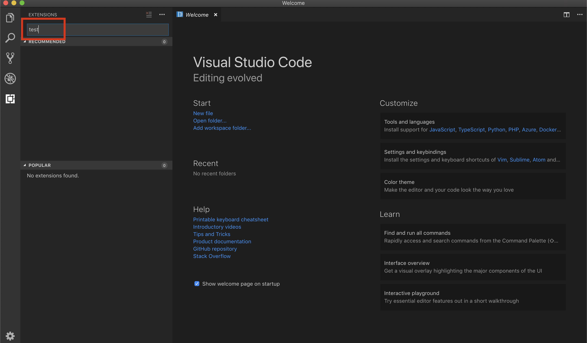
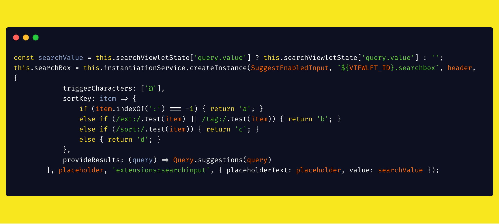

<re-img src="cover.png"></re-img>

One week ago, I posted an article on how I started working on a bug in Microsoft VSCode. If you haven’t read it yet, I recommend checking it out.

## Quick Recap
The search bar in the extensions part doesn’t save the value if you reload the window.


Steps to reproduce this bug:
_1._ Type something in extensions search
_2._ Reload window

After reloading the window, the search bar value has gone.

## Fix
In the last article, I finished my research, my assumption was that extensions search bar needs to implement some kind of `viewletState`, which will keep track of its value. I came to this assumption by comparing extensions search bar with the search bar in the Search part of VSCode because the second one keeps the input value even if you reload the window.

After some time, I got a response from Microsoft’s member, and he confirmed that my guess is right. Thus, I could start developing my solution. Even though I knew what I have to do theoretically, it took me a lot of time to implement this bug fix because codebase is large, and I basically couldn’t figure out where exactly and what I should code.

As I found earlier, `extensionsViewlet` is the component which creates the whole extensions section. When I looked at its code, the following property caught my attention:
```typescript
private searchBox: SuggestEnabledInput;
```

After setting some breakpoints and debugging it, I found that this is the input field that I am looking for. When I debugged my breakpoints, I noticed that after I reload the window, and `searchBox` was rendering, its `SuggestEnabledInput` constructor is called with these parameters:
```typescript
constructor(
    id: string,
    parent: HTMLElement,
    suggestionProvider: SuggestResultsProvider,
    ariaLabel: string,
    resourceHandle: string,
    options: SuggestEnabledInputOptions,
    @IInstantiationService instantiationService: IInstantiationService,
    @IModelService modelService: IModelService,
)
```

I found that `options` parameter consists of
- `placeholderText?: string;`
- `focusContextKey?: IContextKey<boolean>`
and the input parameters are assigned to these `options`.

I tried to add value to the `SuggestEnabledInputOptions` interface, and pass a “test” string in the `extensionsViewlet`. Voilà! Each time `searchBox` is rendered, the default value is “test”:


A small milestone was completed. Now, my task was to keep track of the value and save it inside the state.

Based on the implementation of `viewletState` in the `searchView`, I created a `searchViewletState` in the `extensionsViewlet`.

I declared a state object at the top of the `extensionsViewlet` class:
```typescript
private searchViewletState: object;
```

Then, I wrote a method for saving the state:
```typescript
protected saveState(): void {
    const value = this.searchBox.getValue();
    this.searchViewletState['query.value'] = value;
    super.saveState();
}
```

Finally, I used the value from the `searchViewletState` in the `extensionsViewlet` create method and passed to the `searchBox` constructor inside `options` object (last line):


Here is the result:


As you can see, I type “**react**" in the `searchBar`. Then, I reload the window, and the ``searchBar`` has a value of “**react**”!

## Summary
It was one of the most challenging contributions for me. There are several reasons for that:
- VSCode has a large codebase, so it was difficult to explore the code and not everything was obvious.
- I haven’t worked with TypeScript for a while. However, TS actually helped me at some stages of development, and I consider using it in my future React projects!
- There wasn’t any similar bug fixed in this project before, which is quite seldom for open source projects.

I overcame these challenges, and I was able to fix this issue. I am proud of contributing to the software that millions of developers are using! It’s great to add VSCode to my portfolio of open source contributions.
