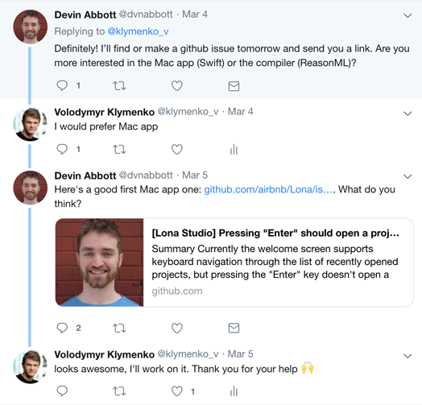
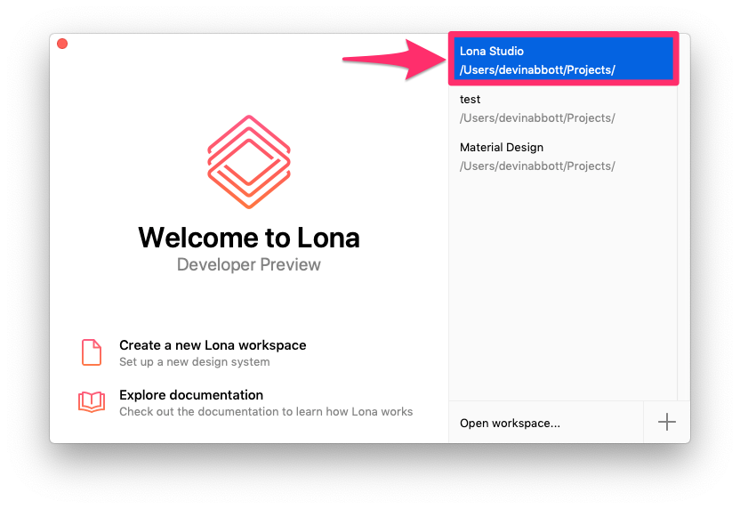

<re-img src="cover.png"></re-img>

Earlier this week, I was looking at <a href="https://github.com/airbnb" target="_blank" rel="noopener noreferrer">Airbnb’s open source</a> projects, and I discovered a project called Lona.

> Lona is a collection of tools for building design systems and using them to generate cross-platform UI code, Sketch files, and other artifacts. (retried from Lona’s GitHub repo)

I really loved the idea of this project, so I chose it to be my next project for my open source course. There aren’t many issues opened, and I wasn’t sure what’s a good task to start with. I’ve used a tip from the project’s README file, which stated:
> If you’re interested in contributing or using it at your company, feel free to open a GitHub issue or get in touch with me on Twitter <a href="https://twitter.com/dvnabbott" target="_blank" rel="noopener noreferrer">@dvnabbott</a>. (Lona README)

So I tweeted to Devin, who is maintaining this project:


He was very kind and helped me to find a good first issue:


Having some experience in open source development, I know how important communication between maintainers and contributors is. I believe that this is the key to building a community around the project and making people want to contribute more in the future. I appreciate his time and help a lot.

Let’s get back to the project itself. Lona consists of 3 parts:
- <a href="https://github.com/airbnb/Lona#lona-components" target="_blank" rel="noopener noreferrer">Lona Components</a> — A data format, `.component`, for cross-platform components
- <a href="https://github.com/airbnb/Lona#lona-studio" target="_blank" rel="noopener noreferrer">Lona Studio</a> — A GUI tool for designing `.component` files, Swift Mac app.
- <a href="https://github.com/airbnb/Lona#lona-compiler" target="_blank" rel="noopener noreferrer">Lona Compiler</a> — A CLI tool & API for generating UI code from `.component` files, ReasonML

As you can see from the tweets above, I chose Lona Studio for my contribution. I decided to focus on Swift development for the next several months, so I would like to work as much as possible with this language. Also, I found it interesting because I haven’t worked with Mac apps before, and, as far as I know, macOS development differs a lot from iOS development.

## Setting Up the Project
First of all, I had to set up the project on my machine. It wasn’t trivial for me because there was one prerequisite that I didn’t have. In order to build Lona Studio from source, you need the following tools to be installed:
- bundler
- CocoaPods
- Carthage

I had CocoaPods and Carthage installed already on my Mac, but I didn’t have Bundler, and I haven’t even heard about it.
> Bundler provides a consistent environment for Ruby projects by tracking and installing the exact gems and versions that are needed. (retrieved from bundler.io)

I have never touched Ruby before, so I had to set up Ruby environment in order to install Bundler. First, you need to install RVM (Ruby Version Manager). Here are the steps I used for installing it:<br />

_1._ Install GnuPG
```shell
brew install gnupg gnupg2
```
_2._ Install RVM’s keys
```shell
gpg --keyserver hkp://pool.sks-keyservers.net --recv-keys 409B6B1796C275462A1703113804BB82D39DC0E3 7D2BAF1CF37B13E2069D6956105BD0E739499BDB
```

_3._ Run verified installation
```shell
curl -sSL https://get.rvm.io | bash -s
```

_4._ Unset default Apple’s Ruby version
```shell
unset GEM_HOME
```

_5._ Load RVM into the Terminal session:
```shell
source ~/.rvm/scripts/rvm
```

_6._ Disable <a href="https://rvm.io/rvm/autolibs" target="_blank" rel="noopener noreferrer">Autolibs</a> (you can read more about this feature here)
```shell
rvm disable autolibs
```

_7._ Install OpenSSL
```shell
brew install openssl
```

_8._ Install Ruby version you want to use. I’ll go with 2.4.0.
```shell
rvm install 2.4.0 --with-openssl-dir=`brew --prefix openssl`
```

_9._ Make it a default version.
```shell
rvm use 2.4.0 --default
```

_10._ Finally, install Bundler 🎉
```shell
```

That’s it 😃


## Issue
The welcome screen of Lona looks similar to XCode’s welcome screen, and the maintainers requested a feature, where pressing “Enter” key on the selected project would open that project. The only way to open the project was to double-click it.


## Implementation
The issue description was very helpful, and it specified the file, which I should look at, and the function I should override.

There was a `RecentProjectList.swift` file that contained the implementation of the list of projects. I wrote a function that would handle “Enter” press, and open the selected project:
```swift
override func keyDown(with event: NSEvent) {  
    let carriageReturnKeyCode = 36  
    if event.keyCode == carriageReturnKeyCode {   
        onOpenProject?(projects[tableView.selectedRow])  
    } 
}
```

Basically, I check if the keyCode of the pressed key is equalled to carriage return key code (36). If it is true, I call the function that opens a specified project:
```swift
onOpenProject?(projects[tableView.selectedRow])
```

It was approved by maintainers and successfully merged into `master` 🥳

However, later Devin noticed that it would crash no rows were selected, so he quickly created a new patch to fix, where he simply added a check for `tableView.selectedRow` to be `≥` than `0`:
```swift
if event.keyCode == carriageReturnKeyCode, tableView.selectedRow >= 0
```

Next time, I’ll be more careful and try to catch possible crashes 😬

Here is the end result of my contribution:


## Summary
It was a nice experience contributing to this project, maintainers are welcome to contributors, and it’s one of the factors why I’m going to contribute more to this project. If you are interested too, check out <a href="https://github.com/airbnb/Lona" target="_blank" rel="noopener noreferrer">GitHub repository of Lona</a>.