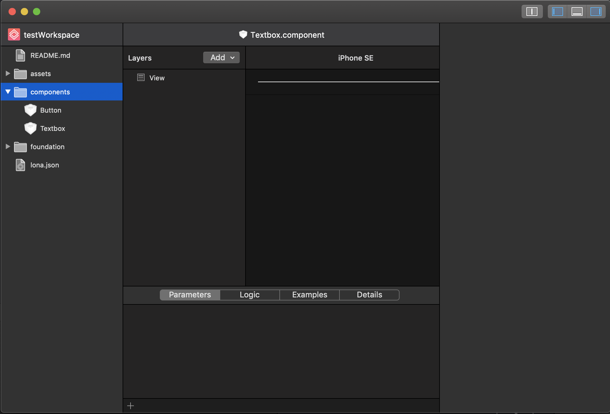
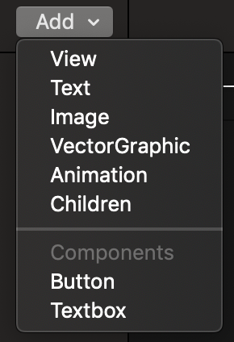

<re-img src="cover.png"></re-img>

I continue exploring and working on Lona as well as learning Swift and macOS development along the way. Let me walk you through the bug I was fixing earlier this week.

## Bug
First of all, let me remind you how UI looks like in Lona:


As you can see on the screenshot above, we have File Navigator on the left, Component Editor in the middle (please note that “Add” menu on top; it’s part of the issue), and Property Inspector on the right.

The app had the following issue:
When a user added, deleted or moved component files to a different location, the “Add” menu, which includes some UI elements and list of components in the current workspace that can be added to the selected component, wouldn’t update the list of components.


In order to update the list of components, the user had to restart the app, which, obviously, was quite annoying.

🔗 <a href="https://github.com/airbnb/Lona/issues/338" target="_blank" rel="noopener noreferrer">Issue description</a>

## Fix
There is a file called `LonaPlugins`, which contains an enumeration `LonaPluginActivationEvent` that consists of some event types:
```swift
enum LonaPluginActivationEvent: String, Decodable {
    case onSaveComponent = "onSave:component"
    case onSaveColors = "onSave:colors"
    case onSaveTextStyles = "onSave:textStyles"
    case onReloadWorkspace = "onReload:workspace"
    case onChangeTheme = "onChange:theme"
}
```

I added a new case to this `enum`:
```swift
case onChangeFileSystemComponents = "onChange:fileSystem:components"
```

As you can guess, it will be triggered once a component was created, deleted or moved.

Next, I triggered this event type on each possible case (creation, deletion, or movement of the file) in the main View Controller `WorkspaceViewController`:
```swift
fileNavigator.onCreateFile = { path, options in
    LonaPlugins.current.trigger(eventType: .onChangeFileSystemComponents)       
}
fileNavigator.onDeleteFile = { path, options in
    LonaPlugins.current.trigger(eventType: .onChangeFileSystemComponents)
}
fileNavigator.performMoveFile = { prev, next in
     LonaPlugins.current.trigger(eventType: .onChangeFileSystemComponents)
}
```

In a nutshell, `WorkspaceViewController` has a variable `fileNavigator` that is an object of class `FileNavigator`, which handles all workspace’s files and has some closures that are executed on the events I’m interested in (`onCreateFile`, `onDeleteFile`, `performMoveFile`).

Finally, I had to subscribe to the `onChangeFileSystemComponents` event and add some behaviour that’s going to be performed when it’s triggered. I had to do it inside the component `LayerListHeader`, which is part of our “Add” menu.
```swift
// subscriptions array of closures
private var subscriptions: [() -> Void] = []
init() {
    super.init(frame: .zero)
    ...
    // subscribe to our event and update menu items when triggered
    subscriptions.append(LonaPlugins.current.register(eventType: .onChangeFileSystemComponents) { [unowned self] in
         self.updateMenuItems()
    })
}
private func updateMenuItems() {
    button.menu(forSegment: 0)?.items = ComponentMenu.menuItems()
}
deinit {
    subscriptions.forEach({ sub in sub() })
}
```

In the first version of my Pull Request, my subscription closure looked like this:
```swift
subscriptions.append(LonaPlugins.current.register(eventType: .onChangeFileSystemComponents) {
         self.updateMenuItems()
})
```
(I didn’t have **[unowned self]** closure parameter), and a reviewer asked me to add it to ensure that it will be deallocated later. I’m still relatively new to Swift, and I’ve never seen and, of course, used **unowned self**, so it was a great opportunity to learn it. Here is one important thing about unowned I learned while reading docs, which applies to my use case above:
> Define a capture in a closure as an unowned reference when the closure and the instance it captures will always refer to each other, and will always be deallocated at the same time.
> Conversely, define a capture as a weak reference when the captured reference may become nil at some point in the future. (Swift documentation)

## Results
Here are some GIFs that shows the final results of my patch 🤠


🔗 <a href="https://github.com/airbnb/Lona/pull/348" target="_blank" rel="noopener noreferrer">Pull request</a>