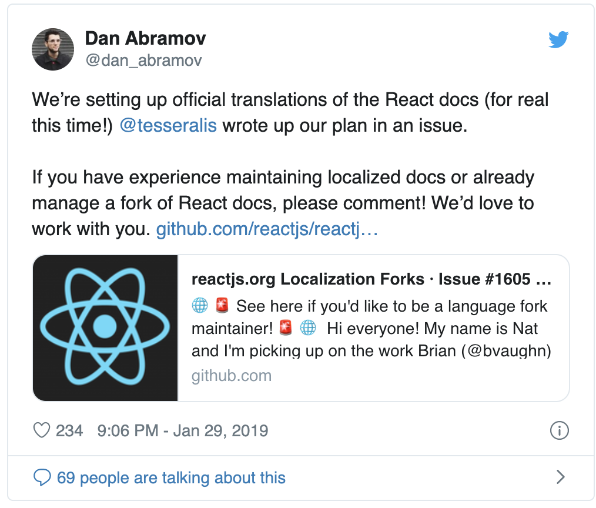
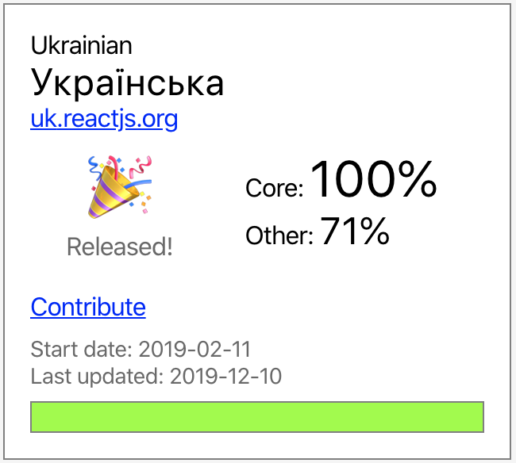

<re-img src="cover.jpg"></re-img>

Last September, I registered for OSD600 as part of my studies at my school (Seneca College, Toronto), and my journey to the world of Open Source Software began. OSD stands for Open Source Development.

> This course introduces students to the technological, social, and pragmatic aspects of developing open source software through direct involvement in large open source projects. Students will learn to use the tools, techniques, and strategies of open source developers. This is a project-based programming course. (retrieved from the <a href="https://wiki.cdot.senecacollege.ca/wiki/OSD600" target="_blank" rel="noopener noreferrer">course website</a>)

This course had an interesting philosophy and outline that are not really typical to other courses: there were no midterms, final exams or any other tests. Instead, students had to contribute to open source projects, along with learning git essentials, and document it by writing blogs. In my opinion, that’s a great idea as students can build their personal brand by blogging. Also, unlike other courses, students are encouraged to collaborate and work together!

I made my first Pull Request (PR) to the project called filer, which is a POSIX-like file system interface for node.js and browser-based JavaScript, at the end of September, and I wrote my <a href="https://medium.com/@volodymyrklymenko/my-first-contributions-to-open-source-world-6af2e77e0eb7" target="_blank" rel="noopener noreferrer">very first blog post</a> related to this course.

I add some tests to the filer in that PR. I feel like it was so long ago, but it actually was less than 7 months ago! I’ve grown as an OSS developer so much since that moment, and I’m excited to share my story in this summary blog post 🥳

## Hacktoberfest 🎃
Shortly after submitting a pull request to filer,  <a href="https://hacktoberfest.digitalocean.com/" target="_blank" rel="noopener noreferrer">Hacktoberfest</a> started, and I had to submit find five issues and submit five pull requests in 4 weeks 😦 It was quite intimidating for several reasons:
_1._ I had to find issues in real projects.
_2._ I had to find solutions to those issues in such a short period of time.

It was so different from the classes where you have assignments, list of tasks you need to complete, and you can imagine how your end result might look like.

Fortunately, students can work on any projects they pick. As I’d just started learning Swift last fall, I decided that it was a great opportunity to enhance my skills and learn new things about iOS development + I also had a Plan B, which was to work on JavaScript projects, in case I wouldn’t find a good issue in Swift projects or I would struggle at 
something.

I ended up participating in the following projects:
- Ethereum Wallet app (Swift) — added Alamofire library (Swift networking library) and replaced all networking calls with Alamofire API.
- Algorithms project (Swift) — added graph algorithms.
- Brave iOS (Swift) — fixed some warnings.
- Adaptive learning (Java) — refactored code by removing a project module.
- Mozilla add-ons (React, CSS) — fixed styling issue for a component.

## Mozilla
After completing Hacktoberfest challenge, I felt much more confident. It was such a boost when my contributions to iOS apps were accepted and merged! I had never built any iOS app at that moment, and my changes were merged into pretty big projects!

In the following two months after Hacktoberfest, I had to deliver 3 contributions that were supposed to be larger. I succeeded in making PRs to iOS apps, so I wanted to continue working on iOS projects. I started exploring available open source options. I was looking at Mozilla’s projects because I had already participated in one of their projects (Add-ons), and I really liked the community there. I found a project called Firefox Focus.

> Firefox Focus for iOS devices is a privacy browser with tracking protection and content blocking. (retrieved from <a href="https://support.mozilla.org/en-US/kb/focus" target="_blank" rel="noopener noreferrer">Mozilla</a>)

I had more time to complete these pull requests comparing to Hacktoberfest, so I picked a couple of larger issues there. There was a couple of bugs in the URL bar of the browser, so I started hacking on them. By the way, these issues were actually bugs comparing to the previous one I worked on. Before, I just refactored code, added some new features, or fixed a small styling issue. Here, I had to fix a real bug in such a big app. These contributions involved more effort, debugging and research time. I started discovering Focus codebase and try to write my own code there. It was more difficult, but hard work pays off!

My patches were accepted and merged into the master branch of Firefox Focus! Later, an update popped up on App Store for Firefox Focus, and that update included my bug fixes! It was an amazing feeling contributing to such a big app, which is used by many people.

 

Thereafter, I had to select my next issue to work on. I thought about proceeding with Focus, but there weren’t any new issues opened at that moment. Our professor brought up a list of issues in the Firefox related to ESLint coverage of its codebase. I thought that I can get an interesting experience working on Firefox because it’s probably one of the most popular and the most used software in the world!

Firefox was released in 2002. As you can imagine, it is a complicated piece of software with a tremendous amount of code. In 2013, a popular JavaScript linting utility called ESLint was created. Many JavaScript projects started integrating it, and Mozilla was not an exception. However, it was extremely hard to cover all JavaScript code of Firefox, so there are many files that are ignored by ESLint.

My task was to enable ESLint int one of the files in the DOM section of Firefox. The whole process working on this issue differed from my previous experiences. First, I had to use Bugzilla instead of GitHub for communicating with maintainers and discussing the issue. Then, the installation of Firefox code locally was different from just making a fork on GitHub and cloning the repo. I needed to install some additional tools for compiling the code. Also, it was a good opportunity to work with Mercurial in order to clone a repo and submit my patch later, and I found it very similar to GitHub.

Eventually, I submitted my changes, and they were also accepted! I literally had left my mark on Firefox code. It was another big accomplishment in my OSD600 class, and that was a great way to conclude my course.

## OSD700
In the winter semester, I had an option to take OSD700 course, which is a second OSD course and includes more advanced contributions. I really enjoyed OSD600, so I registered for OSD700.
I chose Firefox Focus for my first PR because I’d already known it, and I felt like it was a good project to start with. I noticed that the development of Focus was not as active as it used to be in Fall, so I had to pick up issues that were filed some time ago. I sent two PRs to Focus during this term:
_1._ I went through the codebase and refactored it by moving magic numbers into a separate file. It was a good exercise which helped me to learn more about the codebase as I intended to do more development on this project in the future.
_2._ I added UI tests. I’ve never done testing in iOS apps before, so I learned something new doing this contribution.

## Microsoft VSCode
As I mentioned above, the development of this project was not so active, so I decided to look for a new project I can contribute to. I felt confident enough, so I went to large organizations like Microsoft, Facebook, Google, etc.

I stopped at VSCode. I had looked at this project last Fall, but after I saw 4k issues, all my desire was gone. It seemed to me that it was so hard to find a good issue to work on. However, one of my classmates contributed to VSCode, and he shared his strategy on how to find a good issue. The strategy is simple: look at the issues that were filed a long time ago (1 month and longer). I used it, and I found an interesting issue related to an extensions search bar.

The process of installing VSCode locally, fixing the bug, debugging it, submitting PR, and finally, merging it into master branch took almost a month! However, it was a tremendous experience I’d gained during fixing that bug. Also, I was happy about this contribution because millions of developers including me use VSCode almost every day!

## Lona
Even though I had a good time working on VSCode, I wanted to switch back to Swift development, and I started searching for a new project. Again, I looked at major organizations, and I came across a project called Lona in Airbnb GitHub organization. Lona is a design tool, which lets users create and design components, and then generate code for different platforms like React and Swift. I liked the idea of this project a lot.

I found that there were not many issues filed there, but I saw that there a lot of commits pushed every day, so I reached out to Devin (@dvnabbott), who is the maintainer of this project on Twitter:

Devin was very kind and helpful, and he filed some issues in the repository. I fixed a couple of bugs, and I liked the process of working on Lona so much that I decided to work on it till the end of the semester, and maybe even more in the future! Also, I would like to mark the way that issues are filed there: they have amazing descriptions which help new contributors to start working on it quickly. I have sent four patches to Lona so far, and you can find more details about them in my previous posts.

## Ukrainian translation of React documentation
This part was not really a part of my OSD course, however, I believe that OSD classes influenced me a lot, so I would like to share this story.

I was scrolling my Twitter feed, and I came across this tweet:

I develop a lot using React, and I love this library a lot. I wanted to contribute to the React community, and it was a great opportunity to do it, so I applied for it. Shortly after it, the repository for Ukrainian translation was created, and I was assigned to maintain it 🤠

It’s been a new and interesting experience for me because this time, I was not only a contributor but also a maintainer, who is responsible for helping others to start, reviewing their work, and even resolving conflicts. For example, we had two people submitting a translation for the same document, and I solved this issue by taking half of the translation from the first PR and the second half from the other PR.

As of today, we have 100% of core documentation translated:

The documentation website is already available online, so if you speak Ukrainian, check it out 😀

🔗 <a href="https://uk.reactjs.org/" target="_blank" rel="noopener noreferrer">uk.reactjs.org</a>

## Summary
Wow! It’s been less than 7 months, and the progress I’ve made is tremendous. I started with writing simple tests in filer, and I ended up with contributing to projects from large companies like Mozilla, Microsoft, Facebook and Airbnb! I learned so much during working on these projects! I met new people around the world just by working together with them on the same thing. Open Source world is amazing, you can learn, get help, meet new people and make your mark in the codebases of the world’s most used software, and it’s all for free! You don’t even need to be in a specific location; you can just work from wherever you’re located. Also, I would like to thank my professor, <a href="https://twitter.com/humphd" target="_blank" rel="noopener noreferrer">David Humphrey</a>, who taught me about open source and helped me along my journey. I’m glad that I took these courses; it definitely helped me to grow as a developer, and I will try to keep contributing to Open Source Software in the future.
