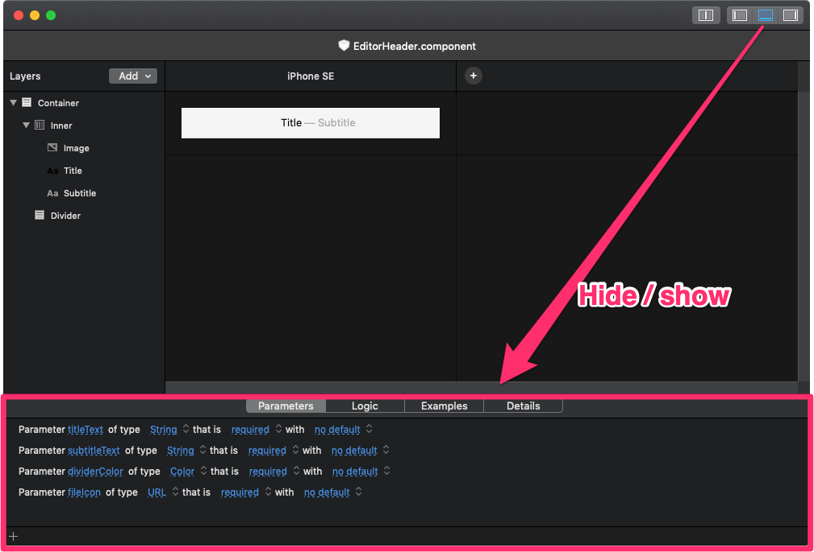

<re-img src="cover.png"></re-img>

It’s Friday, and it’s time for another story about my Open Source journey. I continue working on Lona, and I’ve fixed another bug earlier this week. Let’s take a look at the issue:

## Bug
The interface of Lona is really similar to Xcode’s interface, and it has three panels. One on the right, one on the left, and one in the bottom. The bottom panel contains some utilities such as parameters, logic, examples and details of the component, and for some reasons, the hide/show button in the navbar didn’t do anything. My goal was to implement this functionality.



## Fix
In order to fix this bug, I made the following steps:
_1._ In the `ComponentEditorViewController`, which contains the bottom panel, I wrote a new function that, basically, hides and shows the bottom panel depending on the value passed in the argument:
```swift
private func setBottomItemVisibility(to visible: Bool) {
        if (visible && bottomItem.isCollapsed) || (!visible && !bottomItem.isCollapsed) {
            bottomItem.animator().isCollapsed = !visible
        }
}
```

_2._ I created a public variable `utilitiesViewVisible`, which I’m going to use later in the `WorkspaceViewController`. This variable has a getter that returns the value of `bottomItem.isCollapsed`, and a setter which uses the function from the first step to update the value of `bottomItem.isCollapsed`:
```swift
public var utilitiesViewVisible: Bool {
    get { return bottomItem.isCollapsed }
    set { setBottomItemVisibility(to: newValue) }
}
```

The reason why I made this variable is that `bottomItem` is private, and I cannot access it from the `WorkspaceViewController`.

_3._ Then, I used a newly created variable in the `WorkspaceViewController`:
```swift
// this variable contains an array of all panels in the app.
// I added a conditional statement inside filter function that
// checks whether the current item is bottom one.
// If it is true, it returns value of utilitiesViewVisible
public var activePanes: [WorkspacePane] {
  get {
   return WorkspacePane.all.filter {
      if $0 == .bottom {
        return !(componentEditorViewController.utilitiesViewVisible)
      } else {
        ...
      }
    }
  }
  ...
}
```

Also, I added another conditional statement to the `setVisibility` function which is called when the hide/show button is clicked:
```swift
private func setVisibility(to visible: Bool, for pane: WorkspacePane, animate: Bool) {
    if pane == .bottom {
        componentEditorViewController.utilitiesViewVisible = visible
    } else {
        guard let item = splitViewItem(for: pane) else { return }
        if (visible && item.isCollapsed) || (!visible && !item.isCollapsed) {
            if animate {
                item.animator().isCollapsed = !visible
            } else {
                item.isCollapsed = !visible
            }
        }
    }
}
```

## Result
As you can see in the GIF below, the bottom panel works properly when the hide/show button is clicked.


🔗 <a href="https://github.com/airbnb/Lona/pull/374" target="_blank" rel="noopener noreferrer">Pull request</a>
